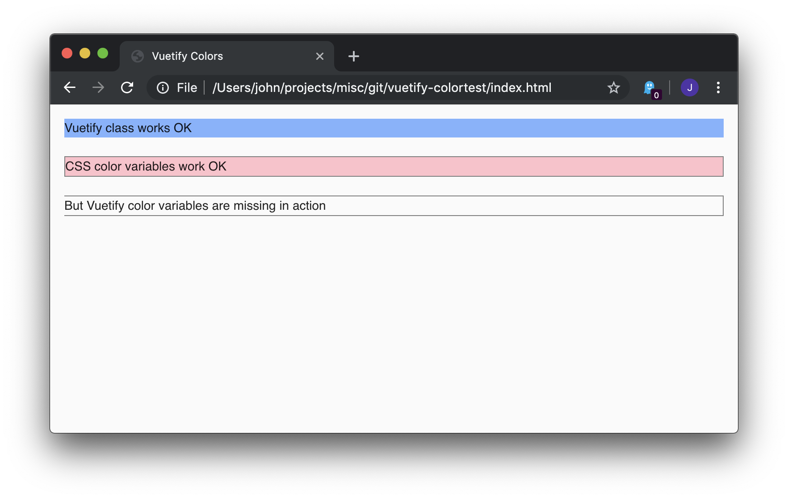

# Vuetify Color Variable Test

The [Vuetify Custom Properties](https://vuetifyjs.com/en/customization/theme#custom-properties)
docs state that 

> Enabling customProperties will also generate a css variable for each theme color,
> which you can then use in your components' &lt;style&gt; blocks.

I have some working examples, but none that include a single file component.

This is the simplest example I can come up with. It has one .vue file and uses rollup
to package it with a single app.js file.

To reproduce:
1. npm install
2. npm run build
3. Navigate browser to index.html

The app displays 3 divs:
* the first div uses the Vuetify class to color its background
* the second div uses plain css color variables to color the background
* the third div uses the Vuetify color variables to set the background
  color and also the left border, neither of which are visible (see screehshot).

